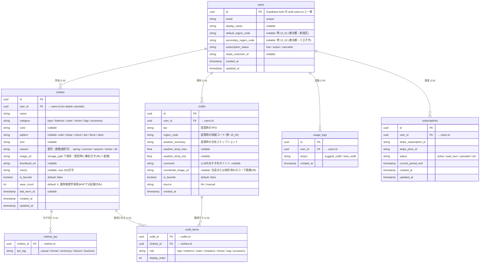

# ER図 — クローゼット管理アプリ

> 地域マスタ（regions）は `backend/app/constants/regions.py` のPython定数で管理するため、**DBテーブルなし**。



---

## 設計上のポイント

| 項目                 | 内容                                                                                            |
| -------------------- | ----------------------------------------------------------------------------------------------- |
| **認証**             | `users.id` は Supabase Auth の UUID と一致。`password_hash` はアプリDBに持たない                |
| **画像**             | DBには URL のみ保存。実体は Supabase Storage に署名付き URL で配信                              |
| **地域マスタ**       | DBテーブルなし。`backend/app/constants/regions.py` に Python 定数として管理（約60〜80件、固定） |
| **TPO**              | `clothes_tpo` で多対多を表現（1着の服に複数のTPOタグを付与可能）                                |
| **コーデ保存**       | 提案のたびに `outfits` にレコードを保存。LLM呼び出し結果のログとして遡れる                      |
| **n:n 中間テーブル** | `outfit_items`（コーデ×服）と `clothes_tpo`（服×TPOタグ）の2つ                                  |
| **Stripe連携**       | `users.subscription_status` は速引きキャッシュ。正規ソースは `subscriptions` テーブル           |
| **着用頻度**         | `wear_count` は MVP では記録のみ。学習・推薦への活用は将来の拡張                                |
| **レート制限**       | `usage_logs` を参照して1日あたりの提案回数を判定（Redis との二重管理）                          |

---

## 地域マスタ（DBなし・定数管理）

```python
# backend/app/constants/regions.py
REGIONS = {
    "01_01": {"prefecture": "北海道", "name": "札幌・道央", "city": "札幌",
              "lat": 43.0618, "lng": 141.3545},
    "01_02": {"prefecture": "北海道", "name": "道北", "city": "旭川",
              "lat": 43.7703, "lng": 142.3650},
    # ... 全47都道府県・計60〜80件
    "13_01": {"prefecture": "東京都", "name": "23区", "city": "新宿",
              "lat": 35.6895, "lng": 139.6917},
    "13_02": {"prefecture": "東京都", "name": "多摩", "city": "八王子",
              "lat": 35.6664, "lng": 139.3160},
    "19_01": {"prefecture": "山梨県", "name": "国中", "city": "甲府",
              "lat": 35.6635, "lng": 138.5683},
    "19_02": {"prefecture": "山梨県", "name": "富士五湖", "city": "河口湖",
              "lat": 35.5103, "lng": 138.7635},
    "19_03": {"prefecture": "山梨県", "name": "八ヶ岳南麓", "city": "北杜",
              "lat": 35.7798, "lng": 138.4274},
}
```

### 細分化の優先度

| 優先度              | 都道府県                                     | 理由                             |
| ------------------- | -------------------------------------------- | -------------------------------- |
| **高**（3〜5地域）  | 北海道、長野、山梨、新潟、岩手、福島、静岡   | 標高差・南北差で気象が大きく違う |
| **中**（2〜3地域）  | 東京、神奈川、千葉、岐阜、鹿児島（離島含む） | 都市部と山間部・島嶼             |
| **低**（1地域で可） | 香川、佐賀、徳島など                         | 県内の気象差が小さい             |

**初期データ整備スケジュール**

- 5/25まで：47都道府県の代表1地点（県庁所在地）で完成
- 6/01まで：高・中優先度に2〜3地点を追加（合計60〜80件想定）
- 以降：「使ってみて足りなければ追加」のスタンス
